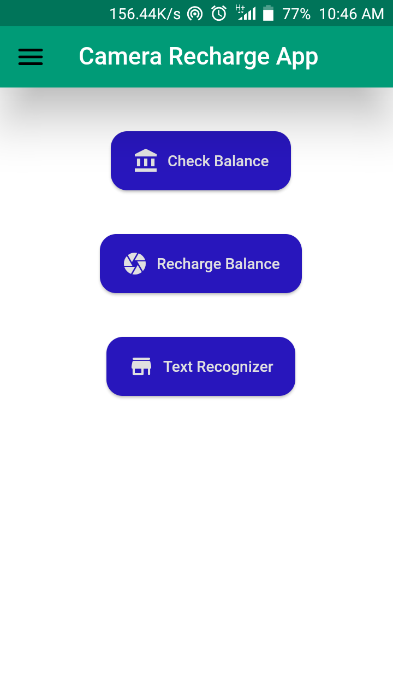
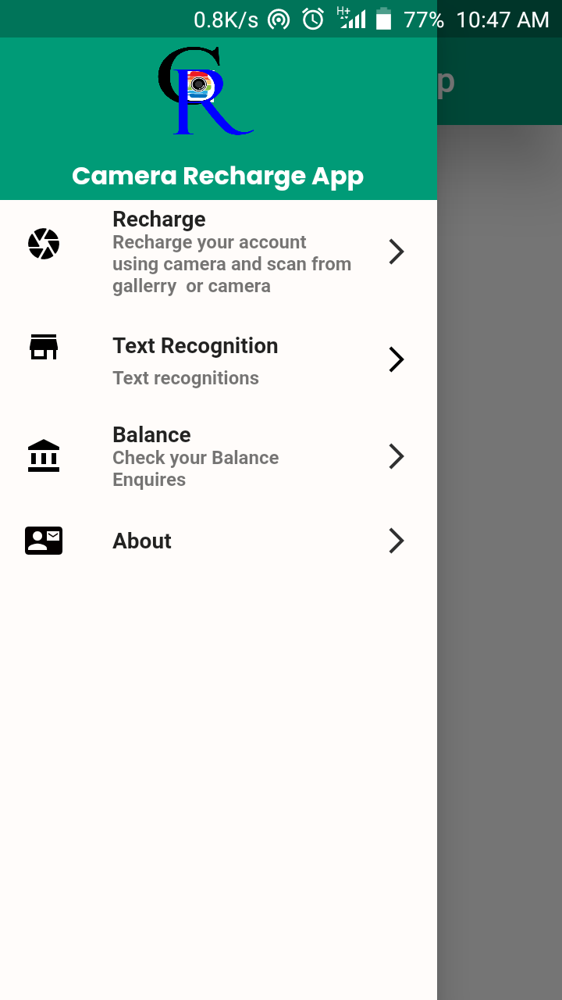
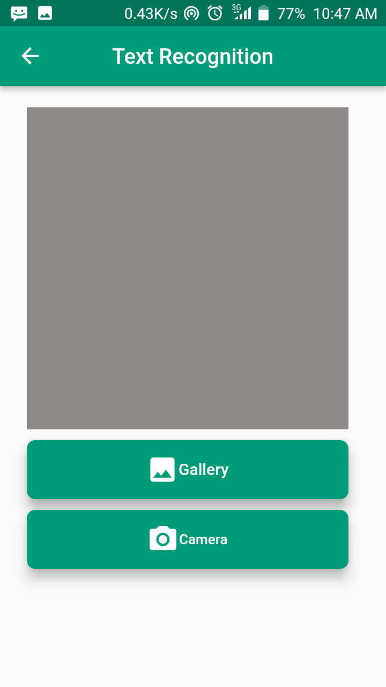

#  Camera Recharge Mobile card

The Camera Recharge Mobile card is a mobile application built with Flutter that allows users to check their balance and recharge their mobile account using their smartphone camera and recognize text 
 using text recognition technology. 

 # Features

- Check your mobile balance by scanning your balance inquiry code with your smartphone camera
- Recharge your mobile account by scanning your recharge card number with your smartphone camera 
- Use text recognition to recognize text from image or directly from camera
- View your your balance
- Easy-to-use interface
# Screenshots
Here are some screenshots of the app:

Home Page

           

Menu page 

   

Recharge page 

 

Text recognition page 

  

# Requirements
- iOS or Android smartphone with a camera
- No Internet connection Required

# Installation
1. Clone the repository
2. Run `flutter pub get` to install the dependencies
3. Connect your smartphone to your computer
4. Run `flutter run` to build and run the app on your device

# Usage
1. Open the app on your smartphone
2. Choose the "Check Balance" or "Recharge" option
3. Hold your smartphone camera up to the balance inquiry or recharge code
4. recognize text from image by following text recognition button on screen
4. View/ check your balance

# Contributing
We welcome contributions from the community! If you find a bug or have an idea for a new feature, please open an issue on this repository or submit a pull request.

 Thank you for visiting our Git page we appreciate your interest in getting to know us better!

